# Avaliação — Engenharia de Software
## Sistema Integrado de Gestão de Farmácia — MVP Definido pelo Estudante

**Aluno:** Mariana Oliveira Paganotti
**RA:** 24001764
**Data:** 25/03/2026

---

## 1. Definição do MVP

O MVP cobre o módulo de **Operação de Vendas** e a **Gestão Básica de Estoque** por unidade. O fluxo contempla desde a identificação do cliente no balcão até a emissão do comprovante, com atualização automática de estoque e controle de acesso por perfil.

Ficaram de fora: Contas a Pagar/Receber, compras e fornecedores, transferências entre unidades, relatórios gerenciais, perfis Financeiro e Administrador, e vendas a prazo ou convênios.

---

## 2. Regras de Negócio

**RN01 -** A venda só pode ser finalizada se todos os produtos do pedido tiverem quantidade disponível no estoque da unidade. Se algum item estiver com saldo insuficiente, a operação é bloqueada.

**RN02 -** Medicamentos controlados (tarja vermelha ou preta) exigem validação e autorização do farmacêutico antes da venda. O atendente não tem permissão para liberar esse tipo de item por conta própria.

**RN03 -** O estoque é atualizado automaticamente a cada movimentação: venda confirmada decrementa o saldo, devolução aprovada incrementa. Ajustes manuais de quantidade por atendentes não são permitidos.

**RN04 -** Quando o saldo de qualquer produto atingir ou ficar abaixo do nível mínimo definido, o sistema gera um alerta para o gerente da unidade. O nível mínimo é configurado por produto e pode ser alterado pelo gerente.

**RN05 -** Cada produto precisa ter um código de barras único no sistema. O preço vigente na venda é sempre o registrado no cadastro no momento da operação — o atendente não pode alterá-lo durante o atendimento.

---

## 3. Requisitos Funcionais

**RF01 -** O sistema deve permitir buscar produtos por nome, código de barras ou fabricante, exibindo descrição, preço de venda, unidade de medida e saldo em estoque da unidade.

**RF02 -** Antes de adicionar um item à venda, o sistema verifica se a quantidade pedida está disponível no estoque. Se não tiver, bloqueia e exibe mensagem de indisponibilidade.

**RF03 -** O sistema deve permitir o cadastro rápido de novos clientes durante o atendimento, informando no mínimo nome, CPF e telefone, sem encerrar a venda em andamento.

**RF04 -** A venda deve ser registrada com: identificação do cliente (opcional), itens com quantidade e valor unitário, valor total e data/hora da operação.

**RF05 -** Ao finalizar a venda, o sistema emite um comprovante com os dados do cliente (quando informado), itens, quantidades e total.

**RF06 -** O estoque da unidade deve ser decrementado automaticamente ao confirmar a venda. Em caso de devolução, o saldo é restaurado.

**RF07 -** O gerente deve conseguir cadastrar e editar produtos, incluindo descrição, código de barras, preço, unidade de medida, fabricante e nível mínimo de estoque.

**RF08 -** O sistema deve exibir alertas automáticos ao gerente quando o saldo de um produto atingir ou ficar abaixo do nível mínimo configurado.

---

## 4. Requisitos Não Funcionais

**RNF01 - Desempenho:** A busca de produtos durante o atendimento deve retornar resultados em até 2 segundos, mesmo com múltiplos atendentes operando ao mesmo tempo.

**RNF02 - Segurança:** O acesso ao sistema exige autenticação por login e senha. As funcionalidades são restritas conforme o perfil do usuário — atendente, farmacêutico ou gerente.

**RNF03 - Usabilidade:** A interface de registro de venda deve ser simples o suficiente para que um novo atendente consiga utilizá-la após no máximo 2 horas de treinamento.

**RNF04 - Confiabilidade:** O registro da venda e a atualização do estoque devem ocorrer de forma atômica. Se houver falha no processo, o sistema reverte ambas as operações para evitar inconsistências.

---

## 5. Casos de Uso

| ID | Nome do Caso de Uso | Ator Principal |
|----|---------------------|----------------|
| UC01 | Realizar Venda | Atendente |
| UC02 | Pesquisar Produto | Atendente |
| UC03 | Verificar Estoque | Sistema |
| UC04 | Identificar / Cadastrar Cliente | Atendente |
| UC05 | Emitir Comprovante de Venda | Sistema |
| UC06 | Autorizar Venda de Medicamento Controlado | Farmacêutico |
| UC07 | Registrar Devolução | Atendente |
| UC08 | Alertar Estoque Mínimo | Sistema |
| UC09 | Cadastrar / Atualizar Produto | Gerente |
| UC10 | Efetuar Login | Atendente / Farm. / Ger. |

**Relacionamentos:**
- `<<include>>`: UC01 -> UC02, UC01 -> UC03, UC01 -> UC04, UC01 -> UC05
- `<<extend>>`: UC06 -> UC01, UC07 -> UC01, UC08 -> UC03

### Diagrama de Casos de Uso

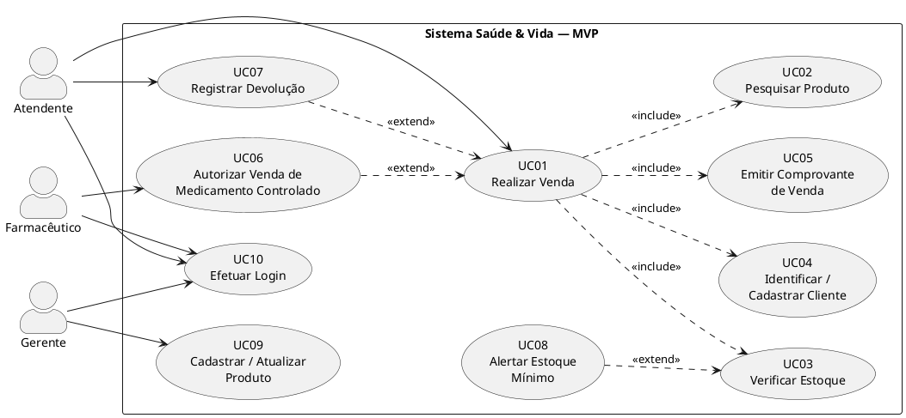

---

## 6. Documentação dos Casos de Uso

---

### UC01 - Realizar Venda

**Ator(es):** Atendente

**Descrição:** Processo completo de atendimento no balcão, desde a identificação do cliente e busca dos produtos até a confirmação da venda e emissão do comprovante.

**Pré-condições:**
- O atendente está autenticado no sistema.
- Há pelo menos um produto com estoque disponível na unidade.

**Pós-condições:**
- A venda está registrada com itens, valores e horário.
- O estoque foi decrementado.
- O comprovante foi emitido.

**Fluxo Principal:**
1. O atendente inicia um novo registro de venda.
2. O sistema solicita a identificação do cliente.
3. O atendente busca ou cadastra o cliente (`<<include>>` UC04).
4. O atendente pesquisa o produto (`<<include>>` UC02).
5. O atendente informa a quantidade desejada.
6. O sistema verifica o estoque (`<<include>>` UC03).
7. O produto é adicionado ao pedido com valor unitário.
8. Os passos 4 a 7 se repetem para cada item adicional.
9. O atendente confirma a venda.
10. O sistema calcula o valor total.
11. A venda é salva e o estoque é atualizado.
12. O sistema emite o comprovante (`<<include>>` UC05).

**Fluxos Alternativos / Exceções:**

- **FA01 -** Se o estoque for insuficiente no passo 6, o sistema exibe mensagem e o item não é adicionado ao pedido.
- **FA02 -** Se o produto for medicamento controlado, o sistema solicita autorização do farmacêutico antes de prosseguir (`<<extend>>` UC06).
- **FA03 -** Se o cliente não for encontrado e não quiser se cadastrar, a venda segue sem vínculo de cliente.
- **FA04 -** Se o atendente cancelar antes da confirmação, o pedido é descartado sem alterar o estoque.

**Relacionamentos:**
- Include: UC02, UC03, UC04, UC05
- Extend: UC06, UC07

#### Diagrama de Atividades - UC01

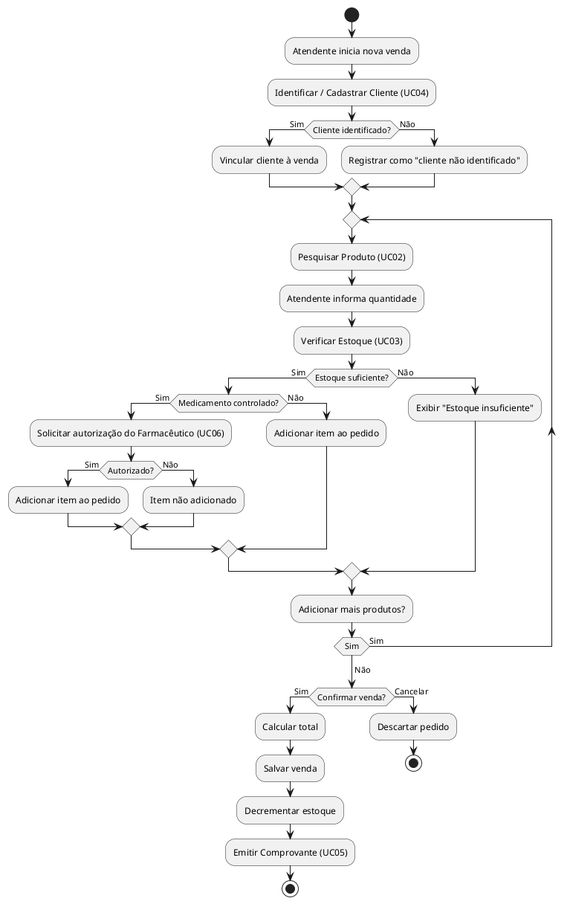

---

### UC02 - Pesquisar Produto

**Ator(es):** Atendente

**Descrição:** O atendente localiza um produto no catálogo da unidade por nome, código de barras ou fabricante.

**Pré-condições:**
- O atendente está autenticado e com uma venda em andamento.
- Há produtos cadastrados no sistema.

**Pós-condições:**
- O produto é selecionado e seus dados são exibidos (descrição, preço, saldo em estoque).

**Fluxo Principal:**
1. O atendente informa o critério de busca: nome, código de barras ou fabricante.
2. O sistema realiza a consulta nos produtos ativos da unidade.
3. O sistema exibe os resultados.
4. O atendente seleciona o produto desejado.
5. O sistema retorna os dados do produto para o contexto da venda.

**Fluxos Alternativos / Exceções:**

- **FA01 -** Se nenhum produto for encontrado, o sistema exibe mensagem e permite nova tentativa.
- **FA02 -** Se houver múltiplos resultados, o sistema lista todos e aguarda a seleção do atendente.

**Relacionamentos:**
- Include: -
- Extend: -

#### Diagrama de Atividades - UC02

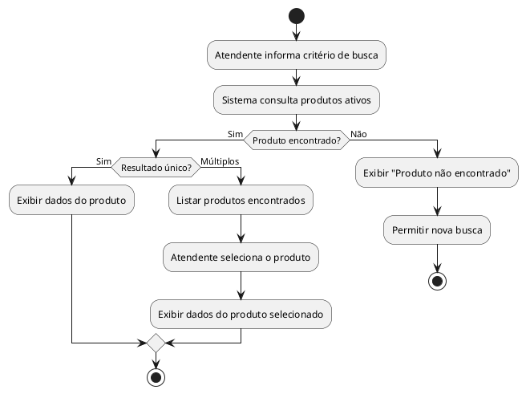

---

### UC03 - Verificar Estoque

**Ator(es):** Sistema (chamado automaticamente durante a venda)

**Descrição:** Verifica se a quantidade solicitada de um produto está disponível no estoque da unidade antes de incluí-lo na venda.

**Pré-condições:**
- Um produto foi selecionado e uma quantidade foi informada.

**Pós-condições:**
- O sistema retorna se o item pode ou não ser adicionado.
- Se o saldo projetado atingir o nível mínimo, o alerta é disparado.

**Fluxo Principal:**
1. O sistema recebe o produto e a quantidade solicitada.
2. Consulta o saldo atual na unidade.
3. Compara a quantidade pedida com o saldo disponível.
4. Se disponível, confirma e reserva temporariamente a quantidade.
5. Verifica se o saldo resultante ficará igual ou abaixo do mínimo (`<<extend>>` UC08).

**Fluxos Alternativos / Exceções:**

- **FA01 -** Se a quantidade pedida for maior que o saldo, retorna status "Insuficiente" para o UC01.
- **FA02 -** Se o saldo for zero, retorna "Sem estoque" imediatamente, sem prosseguir com a comparação.

**Relacionamentos:**
- Include: -
- Extend: UC08

#### Diagrama de Atividades - UC03

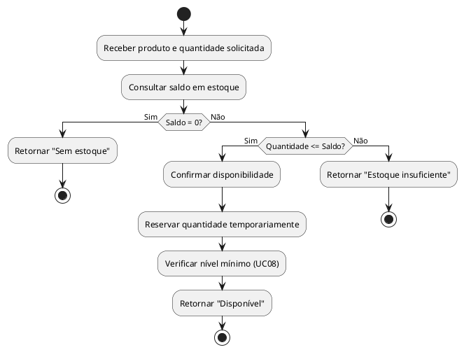

---

### UC04 - Identificar / Cadastrar Cliente

**Ator(es):** Atendente

**Descrição:** O atendente busca o cliente por CPF ou nome para vinculá-lo à venda. Se não tiver cadastro, pode ser registrado de forma rápida sem interromper o atendimento.

**Pré-condições:**
- Uma venda está em andamento.

**Pós-condições:**
- O cliente é vinculado à venda, ou a operação segue sem identificação.

**Fluxo Principal:**
1. O sistema solicita a identificação do cliente.
2. O atendente informa o CPF ou nome.
3. O sistema busca na base de clientes.
4. Os dados do cliente são exibidos.
5. O atendente confirma e o vínculo com a venda é estabelecido.

**Fluxos Alternativos / Exceções:**

- **FA01 -** Se o CPF tiver formato inválido, o sistema exibe erro e solicita nova entrada.
- **FA02 -** Se o cliente não for encontrado e o atendente optar por cadastrá-lo, o sistema exibe formulário mínimo (nome, CPF, telefone), salva e vincula à venda.
- **FA03 -** Se o atendente optar por não identificar o cliente, a venda prossegue sem vínculo.

**Relacionamentos:**
- Include: -
- Extend: -

#### Diagrama de Atividades - UC04

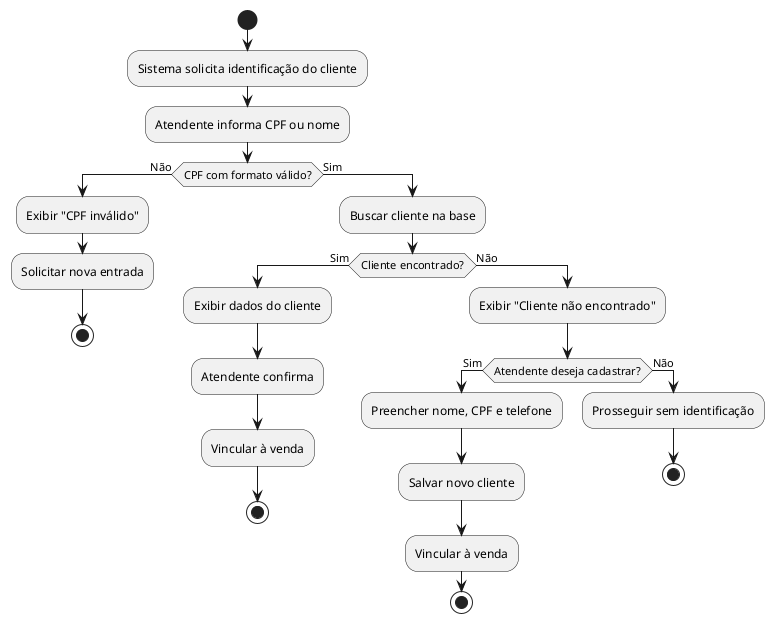

---

### UC05 - Emitir Comprovante de Venda

**Ator(es):** Sistema (disparado ao finalizar a venda)

**Descrição:** Gera o comprovante da venda registrada e disponibiliza para impressão ou visualização na tela.

**Pré-condições:**
- A venda foi salva com sucesso e o estoque atualizado.

**Pós-condições:**
- O comprovante foi gerado e disponibilizado ao atendente.

**Fluxo Principal:**
1. O sistema recebe a confirmação de venda registrada.
2. Coleta os dados: cliente (se informado), itens, quantidades, valores unitários, total e data/hora.
3. Formata o comprovante.
4. Exibe na tela com opção de impressão.
5. O atendente entrega o comprovante ao cliente.

**Fluxos Alternativos / Exceções:**

- **FA01 -** Se a impressora estiver indisponível, o comprovante é exibido na tela e a opção de reimpressão fica disponível. A venda permanece registrada normalmente.

**Relacionamentos:**
- Include: -
- Extend: -

#### Diagrama de Atividades - UC05

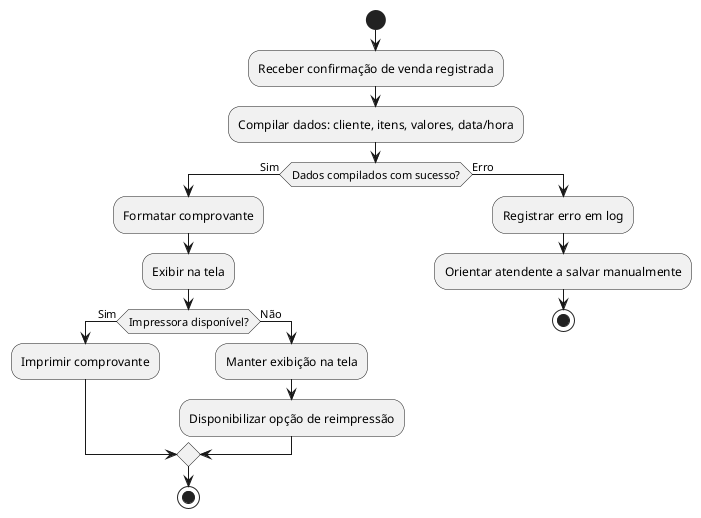

---

### UC06 - Autorizar Venda de Medicamento Controlado

**Ator(es):** Farmacêutico

**Descrição:** Estende o fluxo de venda quando um produto marcado como controlado é adicionado ao pedido. O farmacêutico analisa a receita e registra a autorização ou rejeição.

**Pré-condições:**
- Uma venda está em andamento com produto controlado selecionado.
- O farmacêutico está autenticado no sistema.

**Pós-condições:**
- O item é liberado e adicionado à venda, ou bloqueado com justificativa registrada.

**Fluxo Principal:**
1. O sistema identifica que o produto requer controle.
2. Exibe solicitação de autorização para o farmacêutico.
3. O farmacêutico analisa a receita física apresentada pelo cliente.
4. O farmacêutico registra a aprovação com o número da receita.
5. O sistema libera o item e retorna ao fluxo da venda.

**Fluxos Alternativos / Exceções:**

- **FA01 -** Se a receita for inválida ou ausente, o farmacêutico registra a rejeição com justificativa e o item é bloqueado.
- **FA02 -** Se nenhum farmacêutico estiver logado, o sistema exibe alerta e impede a adição do item até que a autorização seja obtida.

**Relacionamentos:**
- Include: -
- Extend: estende UC01

#### Diagrama de Atividades - UC06

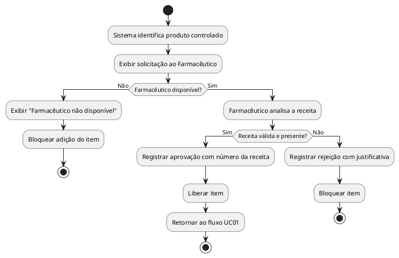

---

### UC07 - Registrar Devolução

**Ator(es):** Atendente

**Descrição:** O atendente registra a devolução de itens de uma venda já realizada. O estoque é recomposto automaticamente com as quantidades devolvidas.

**Pré-condições:**
- O atendente está autenticado.
- Existe uma venda registrada referente aos itens a devolver.

**Pós-condições:**
- A devolução é registrada com referência à venda original.
- O estoque dos produtos devolvidos é incrementado.

**Fluxo Principal:**
1. O atendente acessa a função de devolução.
2. Informa o número da venda original.
3. O sistema localiza e exibe os itens da venda.
4. O atendente seleciona os itens e quantidades a devolver.
5. Confirma a operação.
6. O sistema salva a devolução e atualiza o estoque.

**Fluxos Alternativos / Exceções:**

- **FA01 -** Se o número da venda não existir, o sistema exibe mensagem de erro e solicita nova entrada.
- **FA02 -** Se a quantidade informada para devolução for maior do que a vendida, o sistema bloqueia e exibe aviso de quantidade inválida.

**Relacionamentos:**
- Include: -
- Extend: estende UC01

#### Diagrama de Atividades - UC07

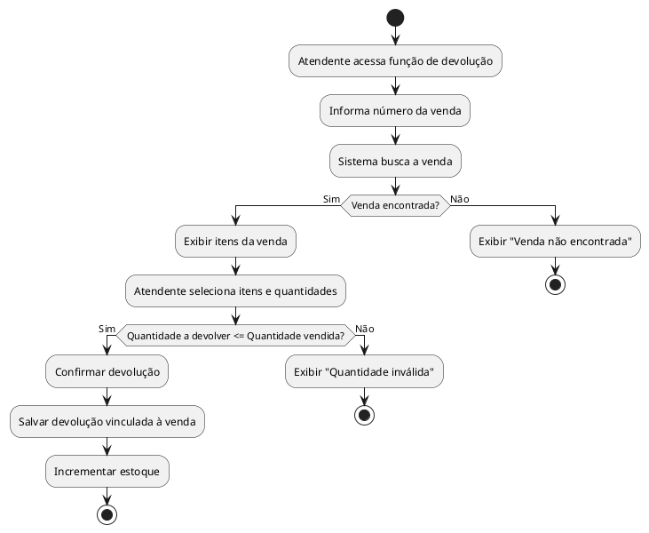

---

### UC08 - Alertar Estoque Mínimo

**Ator(es):** Sistema (disparado automaticamente após movimentação de estoque)

**Descrição:** Detecta quando o saldo de um produto atinge ou fica abaixo do nível mínimo configurado e notifica o gerente da unidade, sem bloquear as operações em curso.

**Pré-condições:**
- O produto tem nível mínimo configurado.
- A verificação de estoque (UC03) identificou que o saldo chegou ou passou do limite.

**Pós-condições:**
- O alerta é registrado e exibido no painel do gerente.

**Fluxo Principal:**
1. O sistema recebe o saldo após a movimentação.
2. Verifica se o produto tem nível mínimo configurado.
3. Compara o saldo atual com o valor mínimo.
4. Gera o alerta com produto, saldo atual e data/hora.
5. Exibe o alerta no painel do gerente da unidade.

**Fluxos Alternativos / Exceções:**

- **FA01 -** Se o produto não tiver nível mínimo definido, o sistema registra em log e não gera alerta.
- **FA02 -** Se já existir um alerta ativo para o mesmo produto na unidade, o sistema atualiza o saldo no alerta existente em vez de criar um novo.
- **FA03 -** Se o gerente não estiver logado, o alerta é armazenado e exibido no próximo acesso.

**Relacionamentos:**
- Include: -
- Extend: estende UC03

#### Diagrama de Atividades - UC08

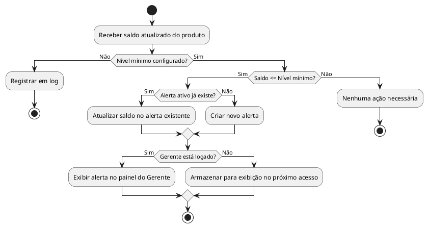

---

### UC09 - Cadastrar / Atualizar Produto

**Ator(es):** Gerente

**Descrição:** O gerente inclui novos produtos no catálogo ou atualiza informações de produtos já cadastrados, incluindo preço, nível mínimo de estoque e se o produto é controlado.

**Pré-condições:**
- O gerente está autenticado com perfil Gerente.

**Pós-condições:**
- O produto está salvo no catálogo e disponível para busca e venda.

**Fluxo Principal:**
1. O gerente acessa o módulo de produtos.
2. Escolhe entre cadastrar novo ou editar existente.
3. Preenche ou atualiza os campos: descrição, código de barras, preço, unidade de medida, fabricante, nível mínimo e flag de controlado.
4. O sistema valida os dados.
5. Salva e exibe confirmação.

**Fluxos Alternativos / Exceções:**

- **FA01 -** Se o código de barras já estiver em uso por outro produto, o sistema bloqueia e exibe mensagem de erro.
- **FA02 -** Se algum campo obrigatório não estiver preenchido, o sistema destaca os campos e impede o salvamento.
- **FA03 -** Para edição, o gerente pesquisa o produto primeiro e depois altera apenas os campos necessários. O fluxo segue a partir do passo 4.

**Relacionamentos:**
- Include: -
- Extend: -

#### Diagrama de Atividades - UC09

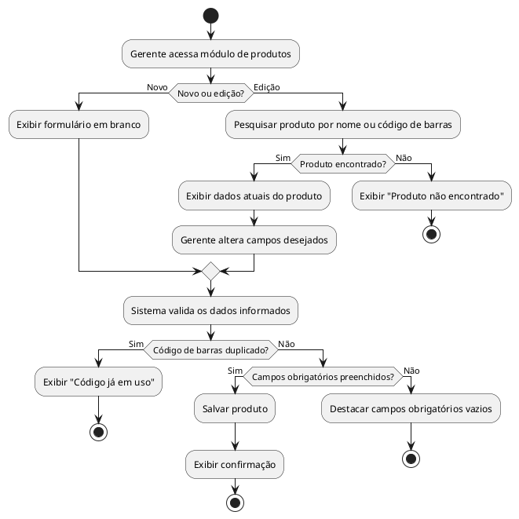

---

### UC10 - Efetuar Login

**Ator(es):** Atendente, Farmacêutico, Gerente

**Descrição:** O usuário se autentica no sistema e é redirecionado para o painel correspondente ao seu perfil.

**Pré-condições:**
- O usuário tem cadastro ativo no sistema.

**Pós-condições:**
- A sessão está iniciada e o usuário tem acesso às funcionalidades do seu perfil.

**Fluxo Principal:**
1. O sistema exibe a tela de login.
2. O usuário informa login e senha.
3. O sistema valida as credenciais.
4. O perfil do usuário é identificado.
5. O sistema redireciona para o painel correspondente e registra o início da sessão.

**Fluxos Alternativos / Exceções:**

- **FA01 -** Se as credenciais estiverem incorretas, o sistema exibe "Usuário ou senha inválidos". Após 5 tentativas consecutivas sem sucesso, a conta é bloqueada por 10 minutos.
- **FA02 -** Se a conta estiver bloqueada ou inativa, o sistema exibe mensagem orientando o usuário a contatar o administrador.

**Relacionamentos:**
- Include: -
- Extend: -

#### Diagrama de Atividades - UC10

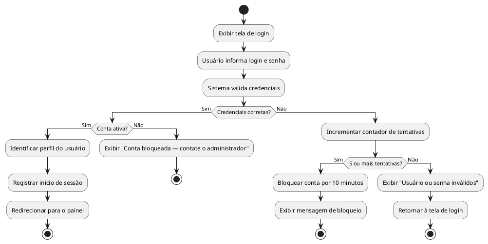
